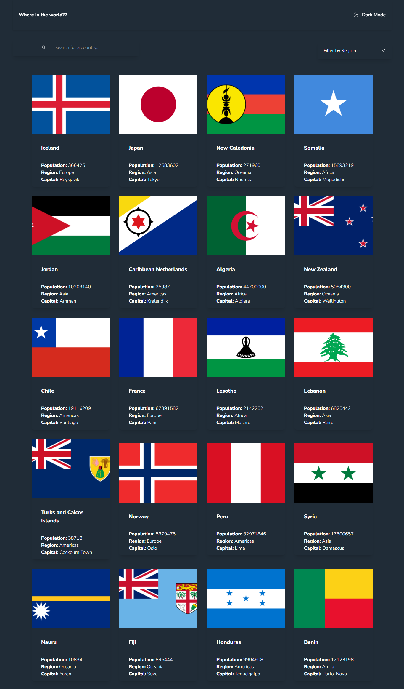
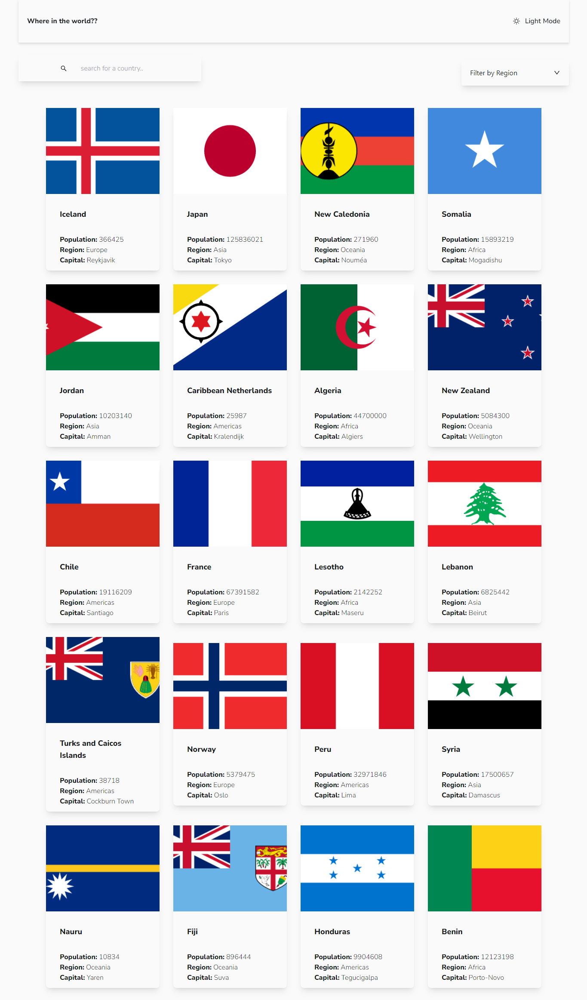

# Rest Countries 

- See all countries from the API on the homepage
- Search for a country using an `input` field
- Filter countries by region
- Click on a country to see more detailed information on a separate page
- Click through to the border countries on the detail page
- Toggle the color scheme between light and dark mode 

## Table of contents

  - [Screenshot](#screenshot)
  - [Links](#links)
  - [Built with](#built-with)
  - [Author](#author)

### Screenshot

### Links

live site url: [Rest Countries](https://newt-rest-countries.netlify.app/){:target="_blank"}

### Biult with

- Semantic HTML5 markup
- CSS custom properties
- Flexbox
- CSS Grid
- Mobile-first workflow
- [TailwindCss](https://tailwindcss.com/){:target="_blank"} 
- [React](https://reactjs.org/){:target="_blank"} - JS library
- [Vite](https://vitejs.dev){:target="_blank"} for faster biuld

## Author

- Frontend Mentor - [@newton-w](https://www.frontendmentor.io/profile/newton-w){:target="_blank"}
- LinkedIn - [@newton](https://www.linkedin.com/in/newton-warui-326917223/){:target="_blank"}

# Run the Project
    npm install
    npm run dev